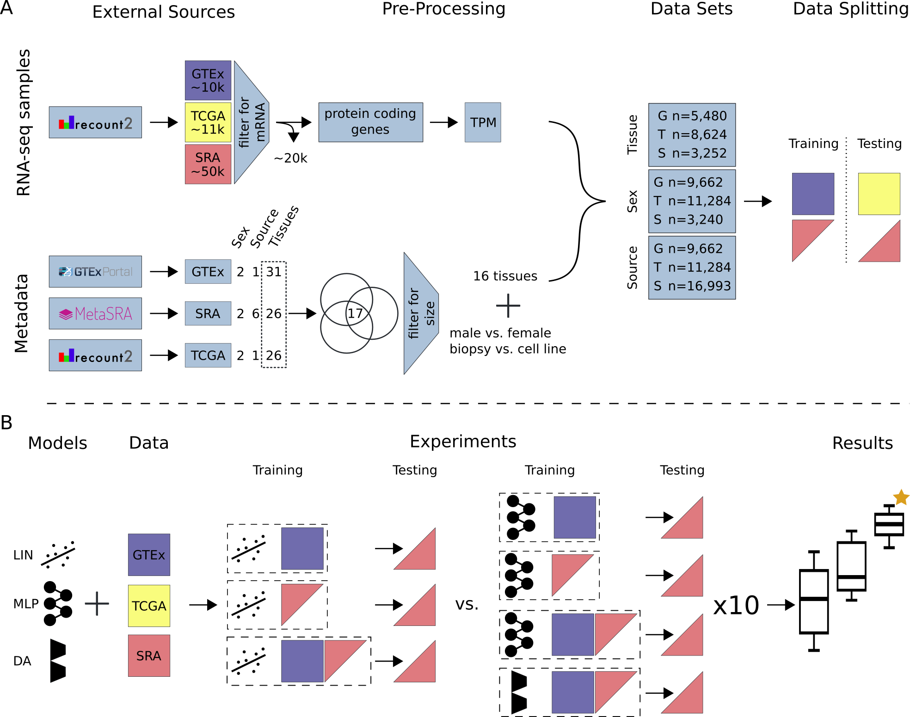

## Bias invariant RNA-seq metadata annotation

**Abstract**
**Background**: Recent technological advances have resulted in an unprecedented increase in publicly
available biomedical data, yet the reuse of the data is often precluded by experimental bias and a
lack of annotation depth and consistency. Missing annotations makes it impossible for researchers to
find datasets specific to their needs. **Findings**: Here, we investigate RNA-seq metadata prediction
based on gene expression values. We present a deep-learning based domain adaptation algorithm for the
automatic annotation of RNA-seq metadata. We show, in multiple experiments, that our model is better
at integrating heterogeneous training data compared to existing linear regression-based approaches,
resulting in improved tissue type classification. By using a model architecture similar to Siamese
networks, the algorithm is able to learn biases from datasets with few samples. **Conclusion**: Using
our novel domain adaptation approach, we achieved metadata annotation accuracies up to 15.7% better
than a previously published method. Using the best model, we provide a list of more than 10,000 novel
tissue and sex label annotations for 8,495 unique SRA samples. Our approach has the potential to revive
idle datasets by automated annotation making them more searchable. The source code as well as an
example are available at: github.com/imsb-uke/rna_augment

**Key words**: RNA-seq metadata, data reusability, automated annotation, machine learning, domain
adaptation, bias invariance

***

In this repository you will find the scripts neccesary to reproduce the main findings form figure 3 and 4 of the main text.
You will find two notebooks.

**phenotype_prediction.ipynb**
In this notebook you are able to load our example data. You will then run one of our MLP experiments resulting in an average accuracy score across multiple seeds. Next you will run the data on the DA model and compare the two results on a box plot. In addition you are able to plot the class accuracy for both models, similar to figure 3D and supplementary figure 7 of the manuscript. 

**bias_vs_sample_size.ipynb**
In this notebook you are able to run the experiment needed to reproduce th data for figure 4 of the manuscript. 

You can find the preprint of our publication on bioRxiv.
https://www.biorxiv.org/content/10.1101/2020.11.26.399568v1

***

**Study Overview** (A) All data available on recount2 was downloaded and split into three data sources: (i) GTEx, (ii)
TCGA and (iii) SRA. Single-cell and small RNA samples as well as technical replicates were removed from the SRA data. Protein
coding genes were selected from the gene count tables and TPM normalized. Metadata for tissue of origin (e.g. heart), source (e.g.
biopsy) and sex phenotype was collected, if available. A subset of 17 tissues (common to GTEx, TCGA and SRA) was selected
and filtered for class size, resulting in 16 tissue classes. For sample source the two largest classes in SRA were selected. Samples
were subsequently annotated and training and testing data sets were created. GTEx was only used for model training unless stated
otherwise. TCGA was only used for model testing. SRA was split such that samples from one study are exclusively in the train
or test set. (B) We compare three models: LIN (linear model), MLP (multi-layer perceptron) and DA (novel domain adaptation
algorithm). Experiments are different combinations of models and data sources. Here, an exhaustive list of experiments for tissue
and sex classification tested on SRA data is depicted. Each configuration (dashed box) is made up of a model and training data.
The previously published LIN model served as a benchmark for our MLP and DA model. Each model configuration was trained
10 times with different seeds to give an estimation of uncertainty. The best model (orange star) was chosen by comparing average
performance across all seeds. After determination of the best model, all available data was used for model training. Previously
unlabeled SRA data was automatically annotated with the appropriate metadata. A list of all new metadata can be downloaded
with the Supplementary Material.
