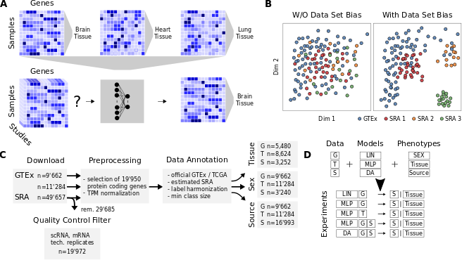
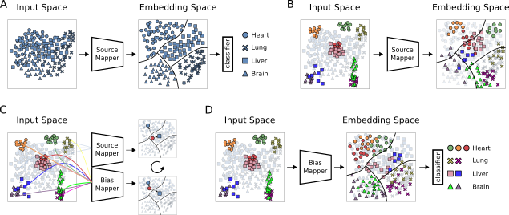

# Bias Invariant RNA-Seq Annotation

Recent technological advances have resulted in an unprecedented increase in publicly available biomedical data, yet the reuse of the data is often precluded by experimental bias and a lack of annotation depth and consistency. Here we investigate RNA-seq metadata prediction based on gene expression values. We present a deep-learning-based domain adaptation algorithm for the automatic annotation of RNA-seq metadata. We show how our algorithm outperforms existing approaches as well as traditional deep-learning methods for the prediction of tissue, sample source, and patient sex information across several large data repositories. By using a model architecture similar to Siamese networks the algorithm is able to learn biases from datasets with few samples. Our domain adaptation approach achieves metadata annotation accuracies up to 12.3% better than a previously published method. Lastly, we provide a list of more than 10,000 novel tissue and sex label annotations for 8,495 unique SRA samples.

# Study Overview

Figure 1. Study Overview. (A) All data available on recount2 was downloaded and split into three data sources: (i) GTEx, (ii) TCGA and (iii) SRA. Single-cell and small RNA samples as well as technical replicates were removed from the SRA data. Protein coding genes were selected from the gene count tables and TPM normalized. Metadata for tissue of origin (e.g. heart), source (e.g. biopsy) and sex phenotype was collected, if available. A subset of 17 tissues (intersection between GTEx, TCGA and SRA) was selected and filtered for class size, resulting in 16 tissue classes. For sample source the two largest classes in SRA were selected. Samples were subsequently annotated and training and testing data sets created. GTEx is only used for model training unless stated otherwise. TCGA is only used for model testing. SRA was split such that samples from one study are exclusively in the test or train set. (B) We compare three models: LIN (linear model), MLP (multi-layer perceptron) and DA (novel domain adaptation algorithm). For the experiments models and data sources were mixed. Given is the exhaustive list of experiments for tissue and sex classification tested on SRA data. Each configuration (dashed box) is made up of a model and training data. The previously published LIN model serves as a benchmark for our MLP and DA model. Each model configuration is trained 10 times with different seeds to give an estimation of uncertainty. The best model (orange star) is chosen by comparing average performance across all seeds. (C) After the best model has been determined all available data is used for model training. Previously unlabeled SRA data (yellow square) can now be automatically annotated with the appropriate metadata. Newly annotated metadata can be used to re-train existing models to further improve performance.

# Domain Adaptation Model

Figure 2. Overview Domain Adaptation Model. Illustration of our DA model architecture and training on hypothetical data. Each shape represents a class, each color a dataset with a unique bias. Source Mapper (SM), Bias Mapper (BM) and classifier layer (CL) are ANN modules. (A) First training cycle: The SM is trained on a single bias dataset, the source domain (SD). In this step, the SM learns a feature embedding. The CL learns how to partition that embedding space into classifiable regions and draws decision boundaries (black lines). (B) For biased test data (colored sample data points), same classes may occupy distinct regions in input space. In this case, the source mapper may not be able to map the samples to the correct region of embedding space, compromising classification performance of the CL. (C) In order to learn the mapping of different biases to the embedding learned in (A), a bias mapper (BM) is created  by copying the SM, and  trained weights of the SM are fixed. In this second training cycle, triplets of samples are passed through the SM-BM configuration, consisting of an anchor from the bias domain and two samples from the source domain, one of them with a matching label. The triplet loss function is defined to minimize distance of like labels in embedding space and to maximize distance of opposite labels. This process is repeated until the SM has learned to map all known biases into the previously learned embedding space. (D) The BM is now able to map data points from previously unseen datasets into the embedding space where the CL can classify them.